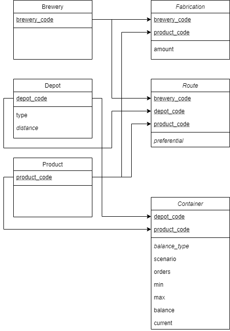
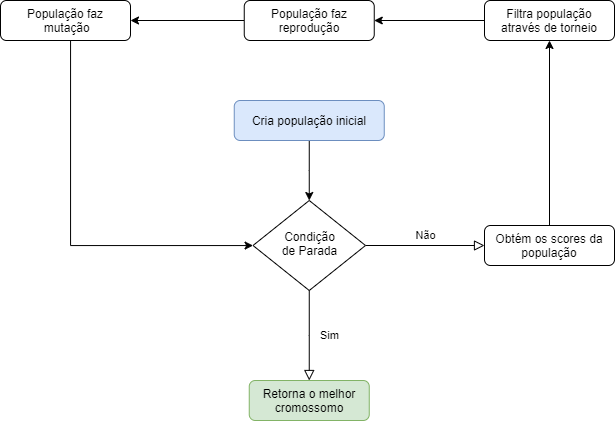

# DNA Recomendado

## Visão Geral  
Sistema de Recomendação que utiliza computação evolutiva para otimizar a distribuição de estoque entre depósitos e cervejarias.

[Link da Apresentação do Projeto](https://storage.googleapis.com/taikai-storage/others/0cc776d0-385f-11ec-b2fd-37da095ce81aentrega_propotipacao.pdf)

### Problema  
Descreva aqui que problema está sendo resolvido, quais as dores, o público alvo  

### Proposta de solução  
Fale sobre a solução q está sendo proposta. Como ela tem o potencial de resolver o problema?  

# Informações Técnicas
## Entidades  
  
> Faça uma diagrama explicativo da estrutura do projeto, pode ser um diagrama de caso de uso, fluxograma, arquitetura do sistema, ou o que vc entender como necessário pra explicar o funcionamento da sua solução.  
*Utilizando a extensão de VSCode: [**Draw.io Integration**](https://marketplace.visualstudio.com/items?itemName=hediet.vscode-drawio) é possível criar um arquivo svg editável apenas utilizando a extensão: ".drawio.svg"  

  

## Pré requisitos
- Conexão com Internet
- Conta Google  
- Navegador compatível com Google Colab

## Processo de instalação e execução
Para executar o código do notebook inteiro faça os seguintes passos:
- 

# Time

[ @magalhastudios1](https://github.com/alexandremendoncaalvaro) 
